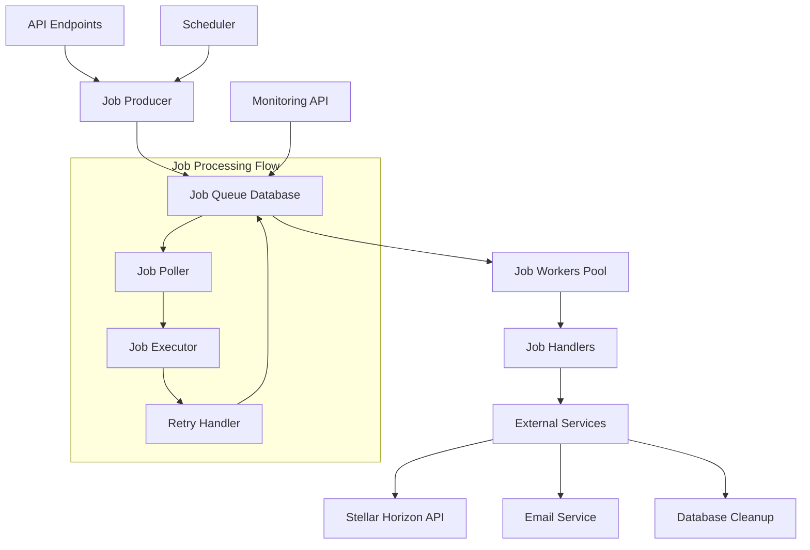

# Design Document: Background Job Processing System

## Overview

The background job processing system will provide asynchronous task execution capabilities for the stellar-tipjar-backend. The system uses a database-backed job queue with multiple worker processes, supporting reliable job execution, retry logic, and monitoring. The design leverages Rust's async capabilities with Tokio for concurrent processing and PostgreSQL for persistent job storage.

## Architecture

The system follows a producer-consumer pattern with the following key components:



The architecture ensures:
- **Reliability**: Jobs are persisted to database before processing
- **Scalability**: Multiple workers can process jobs concurrently
- **Fault Tolerance**: Failed jobs are retried with exponential backoff
- **Observability**: Comprehensive logging and metrics collection

## Components and Interfaces

### Job Queue Manager

The `JobQueueManager` handles job lifecycle management:

```rust
pub struct JobQueueManager {
    pool: PgPool,
    config: JobConfig,
}

impl JobQueueManager {
    pub async fn enqueue(&self, job: Job) -> Result<JobId, JobError>;
    pub async fn dequeue(&self, worker_id: WorkerId) -> Result<Option<Job>, JobError>;
    pub async fn complete(&self, job_id: JobId) -> Result<(), JobError>;
    pub async fn fail(&self, job_id: JobId, error: String) -> Result<(), JobError>;
    pub async fn retry(&self, job_id: JobId) -> Result<(), JobError>;
}
```

### Job Worker Pool

The `JobWorkerPool` manages multiple concurrent workers:

```rust
pub struct JobWorkerPool {
    workers: Vec<JobWorker>,
    shutdown_tx: broadcast::Sender<()>,
    config: WorkerConfig,
}

impl JobWorkerPool {
    pub async fn start(&mut self) -> Result<(), JobError>;
    pub async fn shutdown(&mut self, timeout: Duration) -> Result<(), JobError>;
    pub fn worker_count(&self) -> usize;
}
```

### Job Worker

Individual workers that process jobs:

```rust
pub struct JobWorker {
    id: WorkerId,
    queue_manager: Arc<JobQueueManager>,
    handlers: JobHandlerRegistry,
    shutdown_rx: broadcast::Receiver<()>,
}

impl JobWorker {
    pub async fn run(&mut self) -> Result<(), JobError>;
    async fn process_job(&self, job: Job) -> Result<(), JobError>;
}
```

### Job Handler Registry

Type-safe job handler registration:

```rust
pub struct JobHandlerRegistry {
    handlers: HashMap<JobType, Box<dyn JobHandler>>,
}

#[async_trait]
pub trait JobHandler: Send + Sync {
    async fn handle(&self, job: Job, context: &JobContext) -> Result<(), JobError>;
    fn job_type(&self) -> JobType;
    fn retry_policy(&self) -> RetryPolicy;
}
```

## Data Models

### Job Entity

```rust
#[derive(Debug, Clone, Serialize, Deserialize)]
pub struct Job {
    pub id: JobId,
    pub job_type: JobType,
    pub payload: serde_json::Value,
    pub status: JobStatus,
    pub retry_count: i32,
    pub max_retries: i32,
    pub created_at: DateTime<Utc>,
    pub scheduled_at: DateTime<Utc>,
    pub started_at: Option<DateTime<Utc>>,
    pub completed_at: Option<DateTime<Utc>>,
    pub error_message: Option<String>,
    pub worker_id: Option<WorkerId>,
}

#[derive(Debug, Clone, Serialize, Deserialize)]
pub enum JobType {
    VerifyTransaction,
    SendNotification,
    CleanupData,
}

#[derive(Debug, Clone, Serialize, Deserialize)]
pub enum JobStatus {
    Pending,
    Running,
    Completed,
    Failed,
    Retrying,
    Cancelled,
}
```

### Job Payloads

Type-safe job payloads for different job types:

```rust
#[derive(Debug, Clone, Serialize, Deserialize)]
pub enum JobPayload {
    VerifyTransaction {
        tip_id: Uuid,
        transaction_hash: String,
        creator_wallet: String,
    },
    SendNotification {
        creator_id: Uuid,
        tip_id: Uuid,
        notification_type: NotificationType,
    },
    CleanupData {
        cleanup_type: CleanupType,
        older_than: DateTime<Utc>,
    },
}
```

### Database Schema

```sql
CREATE TABLE jobs (
    id UUID PRIMARY KEY DEFAULT gen_random_uuid(),
    job_type VARCHAR(50) NOT NULL,
    payload JSONB NOT NULL,
    status VARCHAR(20) NOT NULL DEFAULT 'pending',
    retry_count INTEGER NOT NULL DEFAULT 0,
    max_retries INTEGER NOT NULL DEFAULT 3,
    created_at TIMESTAMPTZ NOT NULL DEFAULT NOW(),
    scheduled_at TIMESTAMPTZ NOT NULL DEFAULT NOW(),
    started_at TIMESTAMPTZ,
    completed_at TIMESTAMPTZ,
    error_message TEXT,
    worker_id VARCHAR(50),
    
    INDEX idx_jobs_status_scheduled (status, scheduled_at),
    INDEX idx_jobs_type (job_type),
    INDEX idx_jobs_created_at (created_at)
);
```

## Correctness Properties

*A property is a characteristic or behavior that should hold true across all valid executions of a system-essentially, a formal statement about what the system should do. Properties serve as the bridge between human-readable specifications and machine-verifiable correctness guarantees.*

Now I need to analyze the acceptance criteria to determine which ones can be tested as properties.

### Property Reflection

After analyzing all acceptance criteria, I identified several areas where properties can be consolidated:

- Job status transition properties (1.3, 2.3, 2.4, 2.5) can be combined into comprehensive job lifecycle properties
- Retry behavior properties (1.4, 3.5, 4.4, 6.1, 6.2, 6.3) can be consolidated into retry mechanism properties  
- Job creation properties (3.1, 4.1) can be combined into event-triggered job creation properties
- Cleanup properties (5.2, 5.3, 5.4) can be consolidated into data retention properties
- Persistence properties (1.1, 9.1, 9.2) can be combined into comprehensive persistence properties

This consolidation eliminates redundancy while ensuring comprehensive coverage of all testable behaviors.

### Correctness Properties

Property 1: Job persistence guarantees
*For any* job submitted to the system, the job should be immediately persisted to the database with all required fields populated
**Validates: Requirements 1.1, 9.1**

Property 2: Job serialization round-trip
*For any* valid job payload, serializing then deserializing should produce an equivalent job payload
**Validates: Requirements 1.5**

Property 3: Job lifecycle state transitions
*For any* job in the system, status transitions should follow valid state machine rules (pending → running → completed/failed, with retrying as intermediate state)
**Validates: Requirements 1.3, 2.3, 2.4, 2.5**

Property 4: System recovery completeness
*For any* set of jobs in the system before restart, all pending jobs should be restored after system restart
**Validates: Requirements 1.2, 9.3, 9.4**

Property 5: Retry policy enforcement
*For any* failed job, the retry count should increment and next execution should be scheduled according to the configured retry policy with exponential backoff
**Validates: Requirements 1.4, 6.1, 6.2**

Property 6: Maximum retry enforcement
*For any* job that exceeds maximum retry attempts, the job should be marked as permanently failed and no further retries should be scheduled
**Validates: Requirements 4.5, 6.3**

Property 7: Event-triggered job creation
*For any* system event that should trigger job creation (tip submission, tip verification), the corresponding job should be queued with correct payload
**Validates: Requirements 3.1, 4.1**

Property 8: Job completion status consistency
*For any* job that completes successfully, the job status should be updated to completed and completion timestamp should be recorded
**Validates: Requirements 3.3, 4.3**

Property 9: Job failure status consistency  
*For any* job that fails during execution, the job status should be updated to failed and error information should be stored
**Validates: Requirements 3.4**

Property 10: Data retention policy enforcement
*For any* cleanup job execution, jobs and data older than the configured retention period should be removed according to the retention policy
**Validates: Requirements 5.2, 5.3, 5.4**

Property 11: Scheduled job creation
*For any* configured periodic job (cleanup), the job should be automatically created according to the schedule
**Validates: Requirements 5.1**

Property 12: Job execution tracking
*For any* job that starts execution, the database should be updated with worker ID and start timestamp before job processing begins
**Validates: Requirements 9.2**

Property 13: Graceful shutdown behavior
*For any* shutdown signal received, the system should stop accepting new jobs and wait for running jobs to complete within the timeout period
**Validates: Requirements 8.1, 8.2**

Property 14: Shutdown timeout handling
*For any* shutdown that exceeds the timeout period, remaining running jobs should be cancelled and marked as interrupted
**Validates: Requirements 8.3**

Property 15: Job state transactional consistency
*For any* job state change operation, either all related database updates should succeed or all should be rolled back to maintain consistency
**Validates: Requirements 9.5**

## Error Handling

The system implements comprehensive error handling at multiple levels:

### Job Execution Errors

```rust
#[derive(Debug, thiserror::Error)]
pub enum JobError {
    #[error("Database error: {0}")]
    Database(#[from] sqlx::Error),
    
    #[error("Serialization error: {0}")]
    Serialization(#[from] serde_json::Error),
    
    #[error("Job handler not found for type: {job_type}")]
    HandlerNotFound { job_type: JobType },
    
    #[error("Job execution failed: {message}")]
    ExecutionFailed { message: String },
    
    #[error("External service unavailable: {service}")]
    ServiceUnavailable { service: String },
    
    #[error("Job timeout after {duration:?}")]
    Timeout { duration: Duration },
}
```

### Retry Strategies

Different job types use appropriate retry strategies:

- **Transaction Verification**: Exponential backoff with jitter (1s, 2s, 4s, 8s, 16s)
- **Email Notifications**: Linear backoff (30s, 60s, 120s)  
- **Data Cleanup**: Single retry after 5 minutes

### Circuit Breaker Integration

The system integrates with existing circuit breaker patterns for external service calls:

```rust
pub struct JobContext {
    pub stellar_service: Arc<dyn StellarService>,
    pub email_service: Arc<dyn EmailService>,
    pub circuit_breaker: Arc<CircuitBreaker>,
}
```

## Testing Strategy

The testing strategy employs both unit tests and property-based tests to ensure comprehensive coverage:

### Unit Testing Approach

Unit tests focus on:
- Specific job handler implementations
- Database operations and transactions
- Error handling scenarios
- Configuration validation
- API endpoint responses

### Property-Based Testing Approach

Property-based tests validate universal behaviors using the `proptest` crate:
- Job serialization/deserialization round-trips
- State machine transitions across all job types
- Retry policy enforcement across different failure scenarios
- Data consistency during concurrent operations
- Recovery behavior across various system states

### Test Configuration

- **Property tests**: Minimum 100 iterations per test
- **Test database**: Isolated PostgreSQL instance for each test
- **Concurrency testing**: Multi-threaded scenarios with shared state
- **Integration testing**: End-to-end job processing workflows

Each property test references its corresponding design property:
- **Feature: background-job-processing, Property 1**: Job persistence guarantees
- **Feature: background-job-processing, Property 2**: Job serialization round-trip
- And so forth for all 15 properties

### Mock and Stub Strategy

External dependencies are mocked for unit tests:
- Stellar Horizon API responses
- Email service interactions  
- Database connection failures
- System shutdown signals

Integration tests use real services in containerized environments to validate end-to-end behavior.